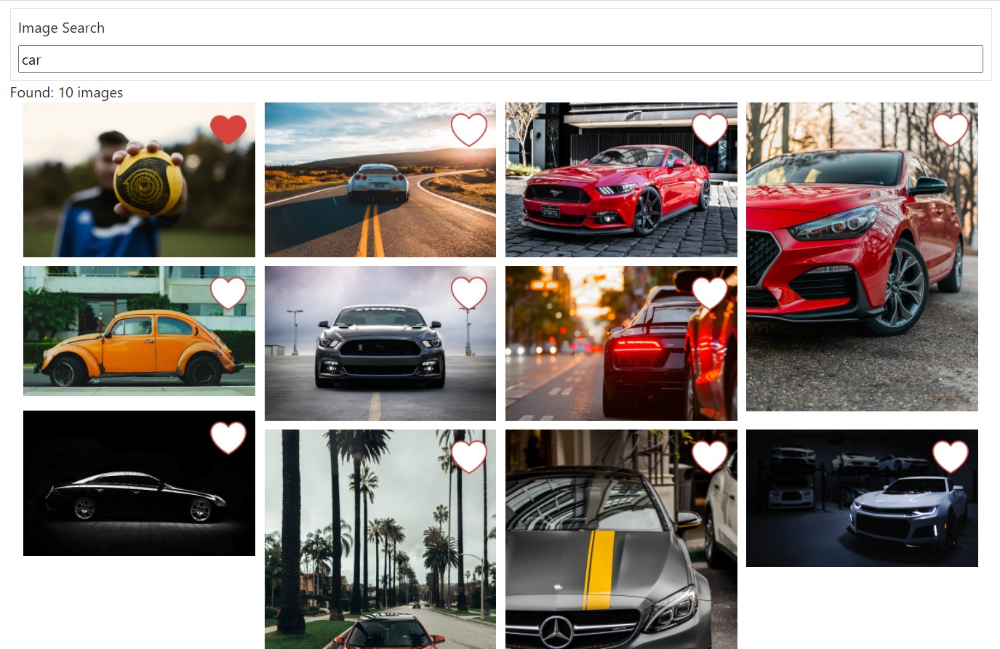
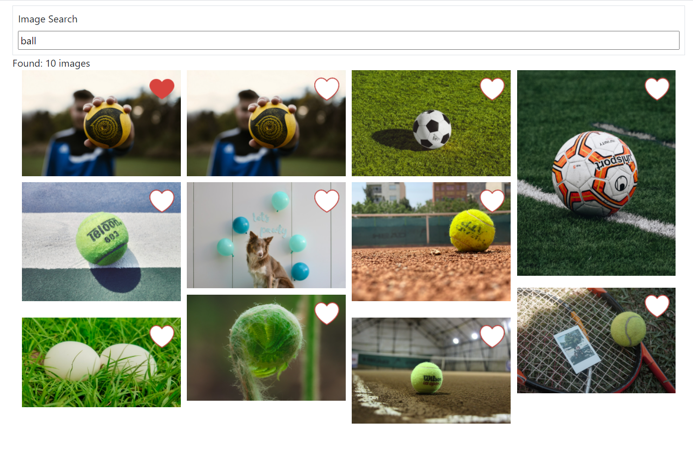
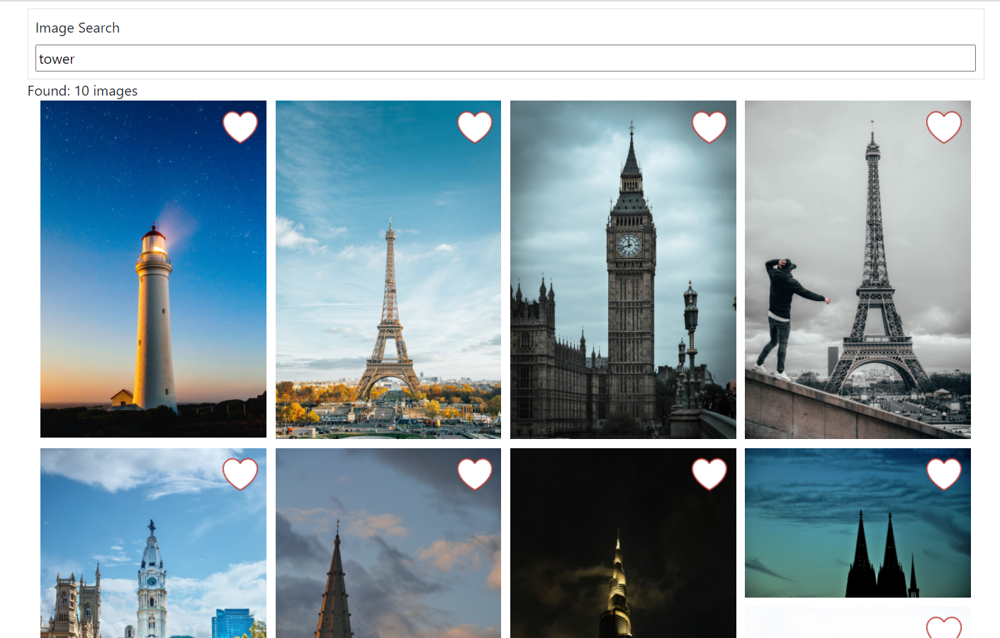

### ScreenShot

## Quick Overview
If you have 'npm install', you can run 'npm start'.
Runs the app in the development mode. 
Open [http://localhost:3000](http://localhost:3000) to view it in the browser.

The page will reload if you make edits. 
You will also see any lint errors in the console.

## Learn More
 
The image data fetched from the Unsplash api https://api.unsplash.com with Authorization: 'Client-ID 3670cc309079825e24e1f14b76c4dc520b50eeb8c37ca3aee601ab5305b120c4'.

It uses Axios, Axios is a lightweight HTTP client based on the $http service.

If you like or dislike the image, the image resource should be added to removed from the new search image resources.

You can learn more in the [Create React App documentation](https://facebook.github.io/create-react-app/docs/getting-started).

To learn React, check out the [React documentation](https://reactjs.org/).

